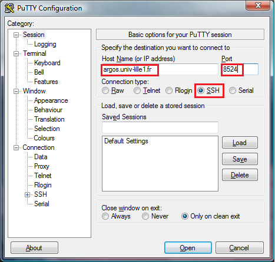
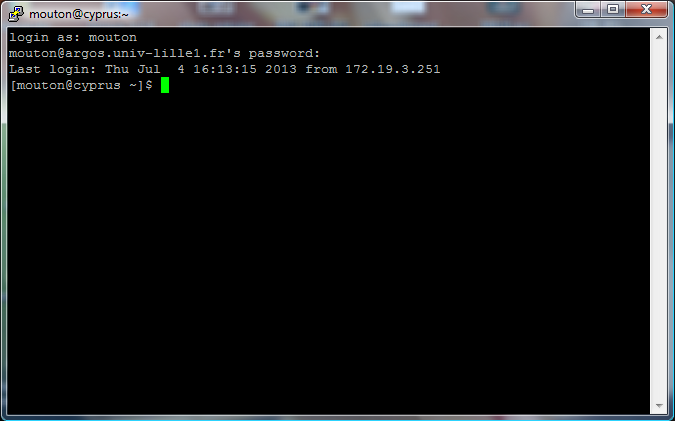
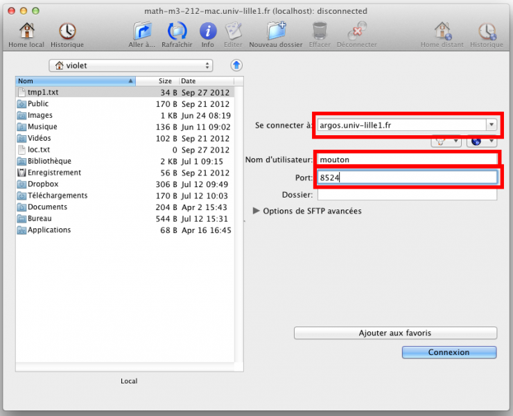
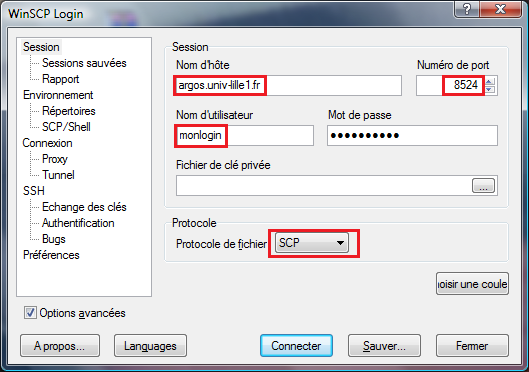

Accès de l'extérieur
====================

Connexion SSH
-------------

.. warning::
  Dans toutes les captures d'écran qui suivent, il faut remplacer ``argos`` par ``math-argos`` qui est le nouveau nom de la machine dans la DMZ Lille1.

Depuis une machine Linux ou Mac OS extérieure au laboratoire
~~~~~~~~~~~~~~~~~~~~~~~~~~~~~~~~~~~~~~~~~~~~~~~~~~~~~~~~~~~~

Ouvrir un terminal et se connecter sur ``math-argos`` pour entrer dans le réseau
privé du laboratoire ::

  ssh -p 8524 monlogin@math-argos.univ-lille1.fr

.. note::
  - l'option ``-p 8524`` est obligatoire (il s'agit du numéro de port ssh).
  - les options d'interface en mode graphique comme ``-X`` où ``-Y`` sont désormais inutilisables. Il est rappelé que la machine math-argos n'est qu'un sas d'entrée dans le réseau privé du laboratoire.

Depuis une machine Windows extérieure au laboratoire
~~~~~~~~~~~~~~~~~~~~~~~~~~~~~~~~~~~~~~~~~~~~~~~~~~~~

#.  Démarrer `PuTTY <http://www.chiark.greenend.org.uk/~sgtatham/putty/download.html>`__.
    Il faut alors renseigner les champs **Host Name** avec ``math-argos.univ-lille1.fr``, le numéro du port avec ``8524`` et vérifier que le type de connexion est bien *SSH*. On peut également sauvegarder ces paramètres en cliquant sur **Save**.

    |image0|

    |image1|

    Enfin, cliquer sur **Open** afin de lancer la connexion.

#.  Une fois le terminal ouvert, il ne reste plus qu'à indiquer le login et le mot de passe pour se connecter à ``math-argos``.

Transferts de fichiers
----------------------

Entre une machine Linux extérieure au laboratoire et Argos
~~~~~~~~~~~~~~~~~~~~~~~~~~~~~~~~~~~~~~~~~~~~~~~~~~~~~~~~~~

#.  Ouvrir deux fenêtres d'un explorateur de fichiers (Nautilus, Konqueror, Nemo...) et, dans l'une d'elles, indiquer le chemin suivant ::

      sftp://monlogin@math-argos.univ-lille1.fr:8524/home/monlogin

#.  Procéder au transfert de fichiers (dans un sens ou dans l'autre) avec
    un simple drag-and-drop.

Entre une machine MacOS extérieure au laboratoire et Argos
~~~~~~~~~~~~~~~~~~~~~~~~~~~~~~~~~~~~~~~~~~~~~~~~~~~~~~~~~~

#.  Démarrer `Fugu <http://sourceforge.net/projects/fugussh/files/>`__.
    Afin de se connecter à ``math-argos``, il faut renseigner les champs *Se connecter à* avec ``math-argos.univ-lille1.fr``, le port avec ``8524``, ainsi que le login. Il est possible de sauvegarder ces réglages en cliquant sur *Ajouter aux favoris*. Enfin, cliquer sur *Connexion*.

       |image2|

#.  L'écran se sépare en 2 parties, l'une indiquant l'arborescence de la machine MacOS, l'autre l'arborescence de ``math-argos``. Déplacer les fichiers de l'une à l'autre avec un simple drag-and-drop.

.. Note:: Cette procédure a été décrite pour MacOS 10.7.5 (merci à Ingrid Violet pour les screenshots). Pour d'autres versions de MacOS, certaines étapes peuvent différer.

.. _AccesWindows:

Entre une machine Windows extérieure au laboratoire et Argos
~~~~~~~~~~~~~~~~~~~~~~~~~~~~~~~~~~~~~~~~~~~~~~~~~~~~~~~~~~~~

#.  Démarrer `WinSCP <http://winscp.net/eng/docs/lang:fr>`__.
    Afin de se connecter à ``math-argos``, il faut créer une nouvelle session dans laquelle il faut renseigner les champs suivants : dans l'onglet *Session*, il faut indiquer ``math-argos.univ-lille1.fr`` pour le nom d'hôte, ``8524`` pour le numéro du port, indiquer le login et le mot de passe, et enfin vérifier que le mode de connexion est bien ``SCP``.

       |image3|

#.  Sauvegarder la session, puis la sélectionner pour se connecter.
#.  L'écran se sépare en 2 parties, l'une indiquant l'arborescence de la machine Windows,
    l'autre l'arborescence de ``math-argos``. Déplacer les fichiers de l'une à l'autre avec un simple drag-and-drop.

.. note:: Si PuTTY est installé au bon endroit dans l'arborescence de la machine Windows (si ce n'est pas le cas, WinSCP indique le répertoire où installer PuTTY), il est possible de démarrer une session PuTTY combinée à l'utilisation de WinSCP avec le raccourci clavier :kbd:`Ctrl+P`.

