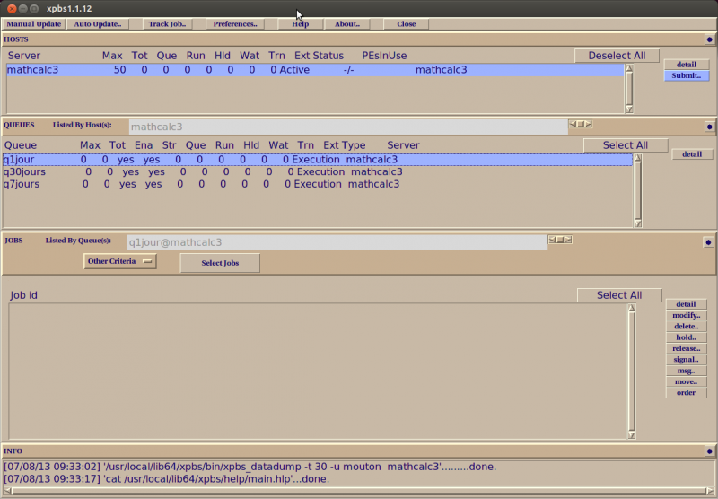

.. _BatchMode:

Soumission de jobs scriptés
===========================

.. highlight:: bash

Un serveur Torque-Maui a été installé sur les machines de calcul du laboratoire Paul Painlevé. Ce logiciel est utilisé pour lancer des calculs longs ou bien des calculs courts mais très nombreux. En effet, lancer de tels calculs «en frontal» (c'est-à-dire en entrant directement la commande d'exécution dans un terminal Unix) même avec l'utilitaire Nohup peut poser des problèmes de gestion des ressources. Il s'agit certes de la méthode la plus simple pour lancer des calculs, mais elle présente l'inconvénient de lancer les calculs dès que la commande d'exécution est saisie. En période de forte demande, cela peut donc poser problème à l'ensemble des utilisateurs.

Le serveur Torque permet de :

- Soumettre des calculs en différé,
- Indiquer de façon précise les ressources en temps, en mémoire, en nombre de coeurs de calcul... dont on aura besoin,
- Faire passer les calculs peu gourmands avant les très gros calculs,
- Suivre l'évolution d'un job,
- Recevoir des alertes par mail du début ou de la fin d'exécution d'un job,
- S'informer sur l'occupation des ressources.

.. Warning:: La soumission et la gestion de jobs ne peut se faire qu'en étant connecté à ``mathcalc3``, même si un job peut être exécuté sur un autre serveur ``mathcalc``.

Soumettre un job scripté
------------------------

Un script Torque se présente généralement sous la forme d'un fichier texte dans lequel on peut spécifier de nombreux paramètres comme la durée maximale d'exécution, la mémoire maximale imposée, etc... Plusieurs exemples de scripts sont disponibles sur :ref:`cette page <ExamplesTorque>`.

Le principe du mode batch consiste à rédiger un script contenant toutes les instructions nécessaires pour compiler un code, l'exécuter, copier des données... mais de façon différée. Après avoir préparé un tel script, il faut le soumettre à au serveur Torque installé sur ``mathcalc3``.

Pour soumettre le job scripté ``monjob.torque``, il suffit d'ouvrir un terminal, de se connecter à ``mathcalc3`` et de taper la commande ::

  [monlogin@mathcalc3 ~]$ qsub monjob.torque
  213.mathcalc3

Ici, le message renvoyé ``213.mathcalc3`` correspond à l'identifiant qui est affecté au job dans la file d'attente.

Ce job sera alors placé dans l'une des 3 files d'attente disponibles (``q1jour`` pour une durée d'exécution limitée à 24 heures, ``q7jours`` pour une semaine, ``q30jours`` pour 30 jours). **Si le calcul lancé dépasse la durée maximale autorisée par la file d'attente, il sera purement et simplement arrêté.** Il faut donc au préalable avoir une idée relativement précise du temps de calcul nécessaire.

Par défaut, la soumission du script ``monjob.torque`` donnera lieu à la création des fichiers ``monjob.err`` et ``monjob.out`` qui vont contenir respectivement les erreurs rencontrées pendant l'exécution et tout se qui s'afficherait dans le terminal.

.. Warning::
  - Si le job soumis doit donner lieu à la création de fichiers de résultats, il est important de bien spécifier quelque part dans le script Torque où l'on se place, par exemple à l'aide de la commande ``cd`` (voir les :ref:`exemples de scripts <ExamplesTorque>`). En effet, par défaut, le serveur Torque effectue les calculs dans un répertoire temporaire qui est effacé dès que le job est terminé.
  - La partie du ``/home`` réservée à chaque utilisateur est limitée et n'est pas destinée à stocker des quantités astronomiques de résultats numériques. Si l'exécution d'un calcul requiert un espace disque très important (plusieurs gigaoctets), il est recommandé de déplacer l'exécution du job dans un répertoire ``/scratch`` (voir les :ref:`exemples de scripts <ExamplesTorque>`). Il faut toutefois garder à l'esprit que les répertoires ``/scratch`` ne sont généralement pas sauvegardés.

Surveiller une file d'attente ou un job
---------------------------------------

Surveiller l'ensemble des jobs
~~~~~~~~~~~~~~~~~~~~~~~~~~~~~~

Pour surveiller l'ensemble des jobs soumis, il suffit de taper la commande ::

  [monlogin@mathcalc3 ~]$ qstat -a

La réponse sera le tableau suivant :

.. code-block:: none

                                                            Req'd  Req'd   Elap
    Job ID         Username  Queue   Jobname SessID NDS TSK Memory Time  S Time
    -------------  --------  ------  ------- ------ --  --- ------ ----  - -----
    209.mathcalc3  monlogin  q1jour  monjob  28957  1   1     --   24:00 C 00:00
    210.mathcalc3  monlogin  q1jour  monjob  29135  1   1     --   24:00 C 00:00
    211.mathcalc3  monlogin  q1jour  monjob  29352  1   1     --   24:00 R --

:Job ID: identifiant du job (imposé par le serveur Torque),
:Username: utilisateur qui a soumis le job,
:Queue: file d'attente dans laquelle le job est placé,
:Jobname: nom du job (donné par l'utilisateur),
:SessID: numéro de la session associée au job s'il est en cours
   d'exécution,
:NDS: le nombre de noeuds de calcul requis par le job (valeur par
   défaut : 1),
:TSK: nombre de tâches requises par le job (valeur par défaut :
   1),
:Req'd Memory: mémoire vive requise par l'utilisateur,
:Req'd Time: temps de calcul requis (valeur par défaut : le temps
   limite associé à la file d'attente),
:S: statut du job (voir `ci-dessous <#statut-job>`__),
:Elap Time: temps écoulé depuis le début de l'exécution.

Surveiller un job
~~~~~~~~~~~~~~~~~

Pour surveiller un job en particulier, il suffit de taper la commande
suivante ::

  [monlogin@mathcalc3 ~]$ qstat -f 212.mathcalc3

La réponse sera de la forme suivante :

.. code-block:: none

    Job Id: 212.mathcalc3
    Job_Name = monjob
    Job_Owner = monlogin@mathcalc3
    resources_used.cput = 00:00:00
    resources_used.mem = 0kb
    resources_used.vmem = 0kb
    resources_used.walltime = 00:00:01
    job_state = C
    queue = q1jour
    server = mathcalc3
    Checkpoint = u
    ctime = Fri Nov 4 09:07:46 2011
    Error_Path = mathcalc3:/home/monlogin/test_Torque/monjob.err
    exec_host = mathcalc3/0
    exec_port = 15003
    Hold_Types = n
    Join_Path = n
    Keep_Files = n
    Mail_Points = e
    mtime = Fri Nov 4 09:07:47 2011
    Output_Path = mathcalc3:/home/monlogin/test_Torque/monjob.out
    Priority = 0
    qtime = Fri Nov 4 09:07:46 2011
    Rerunable = True
    Resource_List.nodect = 1
    Resource_List.nodes = 1
    Resource_List.walltime = 24:00:00
    session_id = 3901
    Variable_List = PBS_O_QUEUE=q1jour,PBS_O_HOME=/home/monlogin,
    PBS_O_LANG=fr_FR.UTF-8,PBS_O_LOGNAME=monlogin,
    PBS_O_PATH=/usr/local/torque/bin:/usr/local/torque/sbin:/usr/local/Scilab/scilab-5.3.1/bin:/usr/lib64/qt-3.3/bin:/usr/local/maui/bin:/usr/local/matlab2008a_64/bin:/opt/intel/bin:/usr/lib64/ccache:/usr/local/bin:/bin:/usr/bin:/usr/local/sbin:/usr/sbin:/sbin:/home/monlogin/bin,
    PBS_O_MAIL=/var/spool/mail/monlogin,PBS_O_SHELL=/bin/bash,
    PBS_O_HOST=mathcalc3,PBS_SERVER=mathcalc3,
    PBS_O_WORKDIR=/home/monlogin/test_Torque
    comment = Job started on Fri Nov 04 at 09:07
    etime = Fri Nov 4 09:07:46 2011
    exit_status = 0
    submit_args = monjob.torque
    start_time = Fri Nov 4 09:07:46 2011
    Walltime.Remaining = 86392
    start_count = 1
    fault_tolerant = False
    comp_time = Fri Nov 4 09:07:47 2011
    submit_host = mathcalc3
    init_work_dir = /home/monlogin/test_Torque

Statut d'un job
~~~~~~~~~~~~~~~~~

:C: job terminé,
:E: finalisation du job en cours,
:H: job mis en pause,
:Q: job mis en file d'attente, pas encore exécuté,
:R: job en cours d'exécution.

Détruire, suspendre et relancer un job
~~~~~~~~~~~~~~~~~~~~~~~~~~~~~~~~~~~~~~

Pour détruire un job, il faut entrer la commande suivante ::

  [monlogin@mathcalc3 ~]$ qdel JobID

où ``JobID`` est l'identifiant du job que l'on peut retrouver dans la
première colonne du tableau obtenu avec un ``qstat -a``. Pour suspendre un
job, il faut entrer la commande suivante ::

  [monlogin@mathcalc3 ~]$ qhold JobID

et pour le relancer ::

  [monlogin@mathcalc3 ~]$ qrls JobID

Bien entendu, on ne peut pas manipuler ainsi les jobs soumis par les
autres utilisateurs.

Utilitaire xpbs
~~~~~~~~~~~~~~~

Il est également possible d'utiliser l'interface graphique ``xpbs`` afin
de suivre en quasi-temps réel l'évolution d'un job. Pour cela, il suffit
de taper la commande ::

  [monlogin@mathcalc3 ~]$ xpbs

et de suivre les instructions qui s'affichent.

  |image0|

