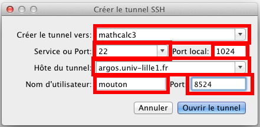
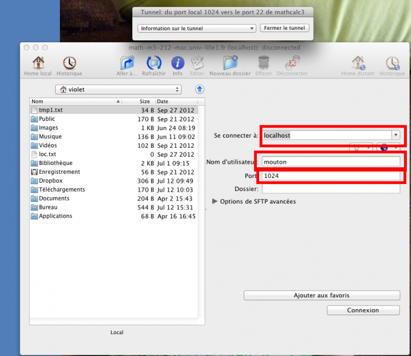
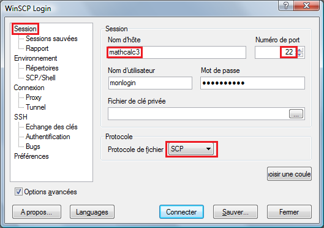
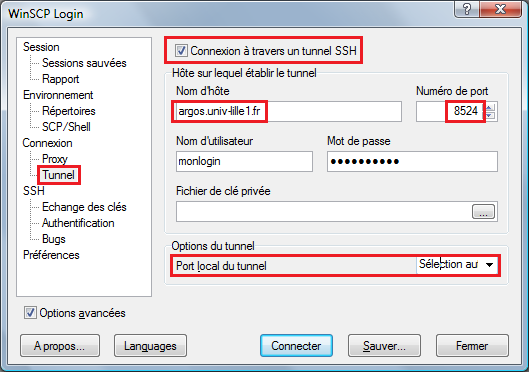

Transferts de fichiers
======================

Entre une machine interne au laboratoire et un serveur
------------------------------------------------------

#.  Ouvrir deux fenêtres d'un explorateur de fichiers (Nautilus, Konqueror, Nemo...) et, dans l'une d'elles, indiquer le chemin suivant : ``sftp://monlogin@mathcalcN/home/monlogin``, ``N`` étant le numéro du serveur voulu. Pour une connexion à ``mathcuda``, il suffit de remplacer ``@mathcalcN`` par ``@mathcuda``.

#.  Procéder au transfert de fichiers (dans un sens ou dans l'autre) avec un simple drag-and-drop.

Entre une machine Linux extérieure au laboratoire et un serveur
---------------------------------------------------------------

#.  Étape préliminaire: inscrire les serveurs dans la liste des serveurs hôtes connus par votre machine. Pour cela, il faut ouvrir le fichier ``~/.ssh/config`` avec un éditeur de texte et ajouter les lignes suivantes ::

      Host mathcalc2
      ProxyCommand ssh -p 8524 argos.univ-lille1.fr nc %h %p
      Host mathcalc3
      ProxyCommand ssh -p 8524 argos.univ-lille1.fr nc %h %p
      Host mathcalc4
      ProxyCommand ssh -p 8524 argos.univ-lille1.fr nc %h %p
      Host mathcalc7
      ProxyCommand ssh -p 8524 argos.univ-lille1.fr nc %h %p
      Host mathcalc8
      ProxyCommand ssh -p 8524 argos.univ-lille1.fr nc %h %p
      Host mathcuda
      ProxyCommand ssh -p 8524 argos.univ-lille1.fr nc %h %p

   Une fois cet ajout fait, on pourra sauter directement à l'étape 2 pour chaque transfert de fichiers !

#.  Ouvrir deux fenêtres d'un explorateur de fichiers (Nautilus, Konqueror, Nemo...) et, dans l'une d'elles, indiquer le chemin suivant : ``sftp://monlogin@mathcalcN/home/monlogin``, N étant le numéro du serveur voulu. Pour une connexion à ``mathcuda``, il suffit de remplacer ``@mathcalcN`` par ``@mathcuda``.

#.  Procéder au transfert de fichiers (dans un sens ou dans l'autre) avec un simple drag-and-drop.

Entre une machine MacOS extérieure au laboratoire et un serveur
---------------------------------------------------------------

#.  Démarrer `Fugu <http://sourceforge.net/projects/fugussh/files/>`_. Il faut commencer par créer le tunnel SSH qui sera hébergé sur Argos. Pour cela, cliquer dans la barre de menu *SSH* > *Nouveau tunnel SSH*.

#.  Dans la fenêtre qui s'ouvre, il faut remplir les champs suivants :

    - **Créer le tunnel SSH vers :** ``mathcalcN``
    - **Service ou port :** ``22``
    - **Port local :** ``1024``
    - **Hôte du tunnel :** ``argos.univ-lille1.fr``
    - **Nom d'utilisateur :** ``monlogin``
    - **Port :** ``8524``

    ..

      |image0|

    .. Note:: les ports choisis sont nécessaires. En effet, l'accès à Argos ne peut se faire que par le port ``8524`` tandis que l'accès à ``mathcalcN`` ne peut se faire que depuis le port ``22``. Enfin, Fugu utilise généralement le port ``1024`` pour réaliser le montage.

#.  Cliquer sur *Ouvrir le tunnel*. Cela ferme la fenêtre d'ouverture de tunnel et en ouvre une autre permettant de refermer le tunnel quand on le souhaite (voir dernière étape).

#.  Revenir à la fenêtre principale de Fugu. Cette fois, on renseigne les champs suivants :

    - **Se connecter à :** ``localhost``
    - **Nom d'utilisateur :** ``monlogin``
    - **Port :** ``1024``

    ..

      |image1|

    Cliquer enfin sur *Se connecter*.

#.  L'écran se sépare en 2 parties, l'une indiquant l'arborescence de la machine MacOS, l'autre l'arborescence de ``mathcalcN``. Déplacer les fichiers de l'une à l'autre avec un simple drag-and-drop.

#.  Une fois les transferts terminés, il ne faut pas oublier de fermer le tunnel SSH.

.. Note:: Cette procédure a été décrite pour MacOS 10.7.5. Pour d'autres versions de MacOS, certaines étapes peuvent être différentes.

Entre une machine Windows extérieure au laboratoire et un serveur
-----------------------------------------------------------------

  |image2|

  |image3|

#.  Démarrer `WinSCP <http://winscp.net/eng/docs/lang:fr>`_. Il faut créer une session basée sur un rebond SSH sur le serveur Argos. Il faut dans un premier temps indiquer le serveur de destination finale, par exemple ``mathcalc3`` en renseignant dans les options de *Session* le nom de la machine hôte par ``mathcalc3``, le numéro du port local par ``22`` (car la connexion entre Argos et mathcalc3 se fera via le port ``22``), le login et le mot de passe sur ``mathcalc3`` et vérifier que le mode de connexion est bien ``SCP``.
    **Ne pas sauvegarder tout de suite, ce n'est pas fini !**

#.  Il faut maintenant configurer le rebond sur Argos. Pour cela, il faut modifier certains paramètres dans les options *Connexion* > *Tunnel*. Plus précisément, il faut cocher la case ``Connexion à travers un tunnel SSH``, renseigner respectivement les noms d'hôte et numéro de port par ``argos.univ-lille1.fr`` et ``8524``, indiquer le login et le mot de passe du compte utilisé sur Argos, et vérifier que le *Port local du tunnel* est bien réglé sur ``Sélection automatique``.

#.  Sauvegarder la session, puis la sélectionner pour se connecter.

#.  L'écran se sépare en 2 parties, l'une indiquant l'arborescence de la machine Windows, l'autre l'arborescence d'Argos. Déplacer les fichiers de l'une à l'autre avec un simple drag-and-drop.

.. Note:: Si PuTTY est installé au bon endroit dans l'arborescence de la machine Windows (si ce n'est pas le cas, WinSCP indique le répertoire où installer PuTTY), il est possible de démarrer une session PuTTY combinée à l'utilisation de WinSCP avec le raccourci clavier ``Ctrl+P``.

