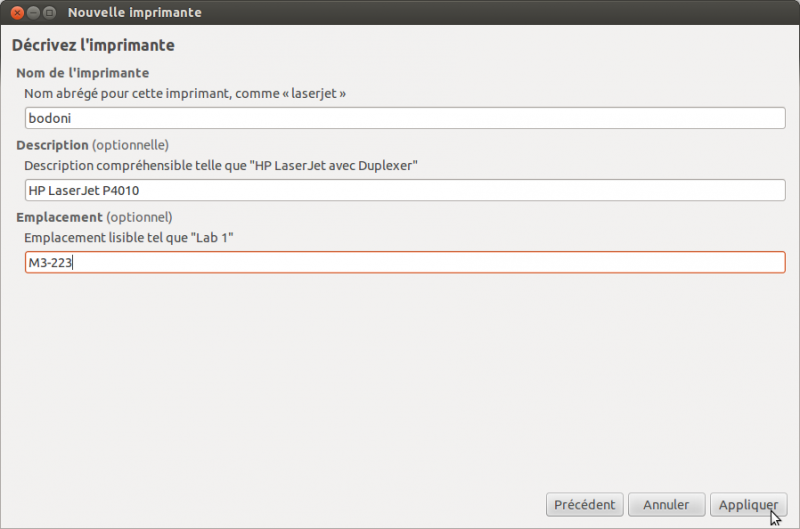

Impression sous Linux
=====================

#.  Dans la fenêtre qui vient de s'ouvrir, choisir l'imprimante par défaut à l'aide d'un clic droit.
#.  Ouvrir un terminal
#.  Taper la commande suivante ::

      system-config-printer

    .. Note:: dans certains cas, il est nécessaire d'avoir les privilèges administrateurs. Dans ce cas de figure, on remplace la commande ci-dessus par
      ::

        sudo system-config-printer

#.  Dans la fenêtre qui vient de s'ouvrir, lancer l'ajout d'une nouvelle imprimante (bouton **Ajouter** ou **Nouveau** selon les distributions)

    |image0|

#.  Dans la liste qui s'affiche, choisir **Internet Printing Protocol** (ipp) et indiquer l'adresse de l'imprimante sous le format ``ipp://mathprint.labomath.univ-lille1.fr:631/printers/nom\_imprimante``

    |image1| |image2|

#.  Choisir le pilote parmi la liste proposée. Par exemple, pour configurer l'imprimante bodoni, on choisira le pilote LaserJet P4010 Series.

    |image3| |image4|

    |image5| |image6|

Définir une imprimante par défaut sur Argos
-------------------------------------------

#.  Ouvrir un terminal
#.  Taper la commande suivante ::

      system-config-printer

