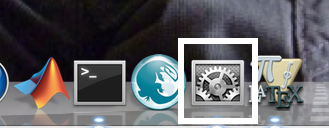
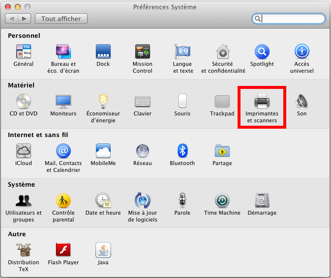
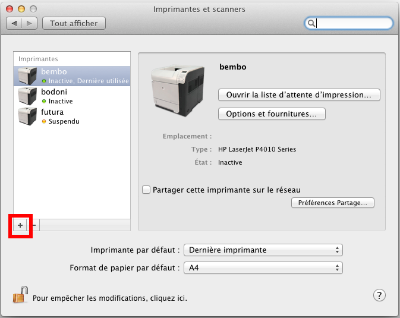
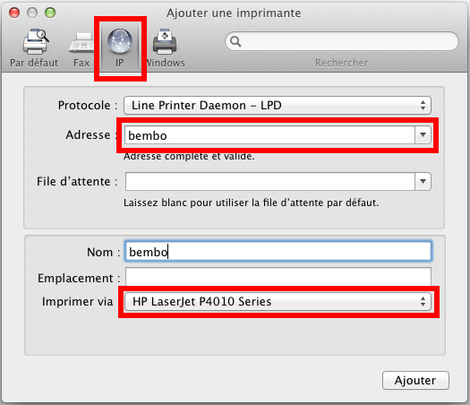

Impression sous MacOS
=====================

La procédure décrite ci-dessous a été faite pour MacOS 10.7.5 (merci à Ingrid Violet pour les explications et les screenshots). Pour d'autres versions de MacOS, certaines étapes peuvent être différentes.

#.  Démarrer l'outil **Préférences Système** > **Imprimantes et Scanners**.

    |image0|

    |image1|

#.  Cliquer sur le bouton **+** pour ajouter une imprimante.

    |image2|

#.  Choisir l'onglet **IP** puis, dans le champ **Adresse**, taper l'adresse IP de l'imprimante recherchée ou son nom d'hôte. MacOS va alors rechercher l'imprimante correspondante sur le réseau et proposer un pilote approprié (voir la :ref:`liste des imprimantes <ListeImprimantes>`).

    |image3|

#.  Cliquer sur *Ajouter* une fois le pilote choisi. Il restera alors à configurer celui-ci.

