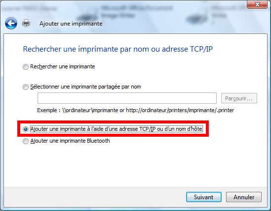

Impression sous Windows
=======================

La procédure décrite ci-dessous a été faite pour Windows Vista (merci à
Vianney Combet pour les explications et les screenshots). Pour d'autres
versions de Windows, certaines étapes peuvent être différentes.

#.  Ouvrir l'utilitaire de gestion d'imprimantes (*Panneau de Configuration* >
    *Imprimantes*) et cliquer sur **Ajouter une imprimante**.

       |image0|

    puis choisir la recherche d'une imprimante réseau.

#.  Windows va lancer une recherche des imprimantes disponibles sur le réseau
    et sortir une liste par adresses IP. Si l'imprimante recherchée n'apparaît
    pas (voir la :ref:`liste des imprimantes <ListeImprimantes>` du
    laboratoire), cliquer sur ``L'imprimante que je veux n'est pas
    répertoriée``.

       |image1|

#.  Il faut alors rechercher l'imprimante voulue en indiquant son adresse IP.
    Pour cela, à l'écran suivant, choisir la méthode ``Ajouter une imprimante
    à l'aide d'une adresse TCP/IP ou un nom d'hôte`` puis cliquer sur
    ``Suivant``.

       |image2|

#.  A l'étape suivante, il faut indiquer soit l'adresse IP soit le nom d'hôte
    de l'imprimante visée et vérifier que le type de périphérique est bien
    réglé sur ``Détection automatique`` et que la case ``Interroger
    l'imprimante et sélectionner automatiquement le pilote à utiliser`` est
    cochée. Enfin, cliquer sur ``Suivant``.

       |image3|

#.  La dernière étape consiste à installer le pilote associé à l'imprimante.
    Il est possible que ce pilote ne soit pas encore installé auquel cas
    Windows demandera de le choisir dans une liste et/ou de le rechercher sur
    Internet. Dans un tel cas, il faut mentionner le nom du constructeur et le
    type d'imprimante (voir la :ref:`liste des imprimantes <ListeImprimantes>`
    du laboratoire).

       |image4|

